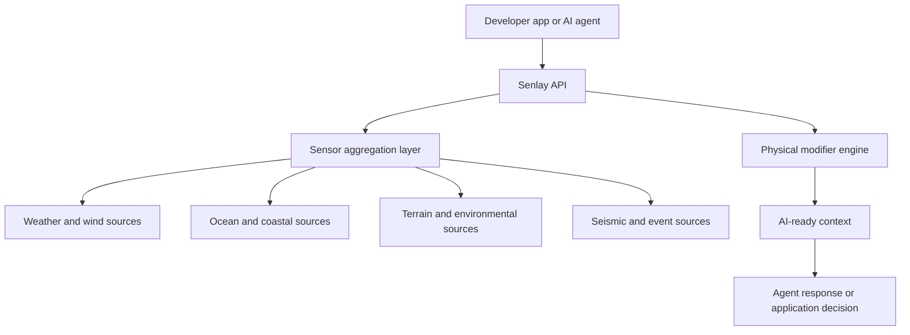

# Senlay Platform

**A sensory intelligence platform for AI agents and real-world applications.**

Senlay gives software live physical-world context: weather, wind, ocean state, terrain, air quality, seismic activity, and environmental signals at real coordinates. It is designed for AI agents, assistants, and developer tools that need to reason from current conditions instead of static knowledge.

[senlay.world](https://senlay.world) · [Public Website](https://github.com/smartsurfsolar/senlay-world) · [Founder Story](https://senlay.world/founder.html)

## What Senlay Does

Senlay turns physical signals into AI-ready context.

```text
Coordinate + intent
        |
        v
Sensor and model aggregation
        |
        v
Physical modifiers
        |
        v
AI-ready context string / API response
```

The platform is built around a simple belief: AI becomes more useful when it can sense the world it is talking about.

## Core Capabilities

- Live physical context for any coordinate
- Weather, wind, ocean, terrain, air-quality, seismic, and environmental layers
- Hardware-first sensor preference where available
- Model fallback where sensor coverage is sparse
- Terrain and coastal modifiers
- AI-agent optimized responses
- Developer API for apps, assistants, and automation
- Public onboarding pages for agent frameworks

## Example Use Cases

- AI agents checking outdoor conditions before giving advice
- Coastal and water-sports safety assistants
- Field-work planning tools
- Travel and location-aware agents
- Environmental monitoring assistants
- Developer products that need current physical context

## Public API Shape

Senlay is exposed through simple HTTP endpoints.

```bash
curl "https://senlay.world/api/v1/sense?lat=10.933&lon=108.287"
```

Example response styles are documented in:

- [`examples/sense-response.json`](examples/sense-response.json)
- [`examples/agent-context.txt`](examples/agent-context.txt)
- [`openapi/senlay.public.yaml`](openapi/senlay.public.yaml)

## Architecture Overview



More detail:

- [`docs/ARCHITECTURE.md`](docs/ARCHITECTURE.md)
- [`docs/API_OVERVIEW.md`](docs/API_OVERVIEW.md)
- [`docs/USE_CASES.md`](docs/USE_CASES.md)
- [`docs/ROADMAP.md`](docs/ROADMAP.md)

## Repository Purpose

This repository documents the platform, API shape, examples, and product direction.

## Contact

- Email: [smartsurfsolar@gmail.com](mailto:smartsurfsolar@gmail.com)
- WhatsApp: [+84 3333 801 68](https://wa.me/84333380168)
- LinkedIn: [Viktor Kryvotsiuk](https://www.linkedin.com/in/viktor-kryvotsiuk-0b7449151/)
- Ko-fi: [ko-fi.com/senlay](https://ko-fi.com/senlay)

## Ownership

Copyright 2026 Senlay / SmartSurf Solar. All rights reserved.
