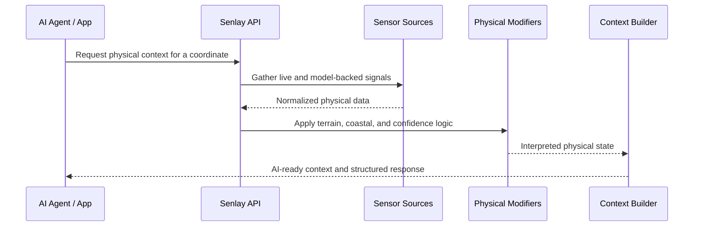

# Architecture

Senlay is organized as a physical-context pipeline.

## 1. Request

An application or AI agent asks for context at a coordinate. The request may be general, such as "sense this place," or specific, such as "is this a good time for a water session?"

## 2. Source Aggregation

Senlay combines multiple categories of physical-world data:

- weather and wind
- ocean and coastal data
- terrain and elevation
- air quality and environmental data
- seismic and event signals
- satellite-backed sources where useful

The platform prefers live sensor readings when available and uses model data as fallback coverage.

## 3. Physical Modifiers

Raw conditions are not enough. Senlay adds physical interpretation:

- terrain exposure
- coastal effects
- gust risk
- wave and wind relevance
- confidence and source quality
- safety-oriented context where appropriate

## 4. AI-Ready Output

The final output is designed for machines and people:

- structured values for software
- concise context for LLMs
- readable summaries for agents
- source-aware interpretation

## High-Level Flow

## Design Principles

- Live reality beats static assumptions.
- Sensor readings are preferred where coverage exists.
- Model data should be labeled by confidence and role.
- The output must be easy for an AI agent to use without over-parsing.
- Safety-critical context should be clear, conservative, and source-aware.
